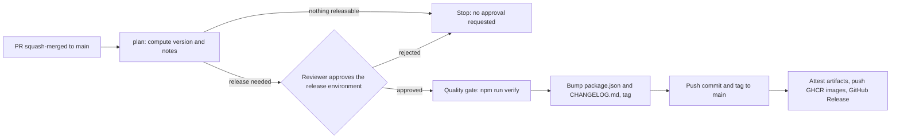

# PNC Risk Console Walkthrough

Run it, use it, debug it, change it safely. Pick your path.

| You are | Go to |
|---|---|
| New to the project, on Windows 11 | **Part 1** then **Part 2** |
| On Ubuntu or WSL2 | **Part 3** |
| Debugging in VS Code | **Part 5** |
| About to open a pull request | **Part 6** and **Part 7** |
| Something broke | **Troubleshooting** at the end |

---

## Part 1 · Windows 11 setup (Command Prompt)

1. Install tools once:
   ```bat
   winget install --id Git.Git -e
   winget install --id OpenJS.NodeJS.LTS -e
   winget install --id Microsoft.VisualStudioCode -e
   winget install --id Docker.DockerDesktop -e
   ```
   Restart the terminal. `node -v` must print **v22.22 or newer** (the repo pins 22.22.3 in `.nvmrc`; Angular 22 needs Node 22.22.3+ for a warning-free install).
2. Get the code:
   ```bat
   cd %USERPROFILE%\code
   git clone https://github.com/sm2774us/pnc-risk-console.git
   cd pnc-risk-console
   ```
3. Install (also installs the Git hooks that check commit messages):
   ```bat
   npm ci
   ```

## Part 2 · Run and use it (novice steps)

1. Start everything: `npm run dev`. Wait for both lines: BFF listening on **3000**, Angular on **4200**.
2. Open <http://localhost:4200>. You are sent to **Sign in**.
3. Choose a persona. They differ on purpose:

   | Persona | Sees insured names | Export CSV | Stress run | Status page |
   |---|:-:|:-:|:-:|:-:|
   | Vera Viewer | masked | no | no | no |
   | Uma Underwriter | yes | yes | no | no |
   | Rami Risk-Manager | yes | yes | yes | no |
   | Ada Admin | yes | yes | yes | yes |
4. **Dashboard.** Six KPIs, a trend line, line-of-business and peril charts, and the PML ladder (1-in-100 and friends).
5. **Exposures.** The grid loads 100 rows at a time from the server (50,000 exist). Try: drag *Line of business* into the row-group bar; open the **Filters** side tab; set a number filter on TIV; sort; click a policy to open its detail page. Reload the page and your column layout returns (saved in the browser). Without an Ag-Grid licence key a watermark shows; everything still works.
6. **Policy detail.** Compare the **modern** rating with the **legacy ES5** engine. Differences are flagged, not hidden.
7. **Accumulation** (as Rami or Ada). Move the severity and frequency sliders: the map updates instantly (client estimate). Press **Run authoritative stress** to get the server's answer, which is the number to quote.
8. **Resilience demo.** Stop the BFF (`Ctrl+C` in its terminal, or run `npm run dev:web` alone). Reload the dashboard: the last known numbers stay on screen with a *degraded / last known* banner and a Retry button. Restart the BFF and the banner clears.
9. **Admin status** (as Ada): service state, version, uptime, circuit-breaker state.
10. Stop with `Ctrl+C`. Full container run: `docker compose up --build`, then <http://localhost:8080>.

**Run every check:** `npm run verify`. **End-to-end:**
```bat
npx playwright install chromium
npm run build
npm run test:e2e
```

## Part 3 · Ubuntu or WSL2

Work inside the Linux filesystem (`~/code`, not `/mnt/c/...`) or installs and file watching crawl.
```bash
git clone https://github.com/sm2774us/pnc-risk-console.git ~/code/pnc-risk-console && cd ~/code/pnc-risk-console
nvm install && nvm use
npm ci
npm run dev        # web :4200, BFF :3000
```
Then follow Part 2 from step 2. Shortcuts: `make verify`, `make e2e`, `make docker-up`. Windows browsers reach WSL servers at `http://localhost:...`.

## Part 4 · How automation works

Five workflows, all with actions pinned to commit SHAs and least-privilege `permissions:`.

| Workflow | Trigger | Purpose |
|---|---|---|
| `pr-verification.yml` | Pull request to `main` | Gate for every change (jobs below) |
| `release.yml` | Push to `main` | Plan a release, **wait for your approval**, then version, changelog, tag, GitHub Release, signed artifacts, GHCR images (Part 10) |
| `housekeeping.yml` | Sundays 06:00 UTC, manual | Deletes failed, cancelled and old runs; keeps the newest successful run per workflow (Part 11) |
| `codeql.yml` | PR, push, weekly | Static security analysis (runs on public repositories) |
| `deploy.yml` | Manual | Keyless OIDC deploy to EKS or GKE (Part 12) |

`pr-verification.yml` jobs:

| Job | What it proves |
|---|---|
| `guard` | PR title is a Conventional Commit (it becomes the squash commit and drives the release); no `dependabot.yml` or Renovate config exists |
| `verify` | Prettier; **affected-only** ESLint (Nx boundaries, Angular a11y), typecheck, unit tests and production builds; BFF integration tests; release-tool tests; `npm audit` (high and critical) |
| `e2e` | Playwright on desktop and Pixel 7: RBAC, masking, export, degraded mode, axe scans |
| `docker` | Both images build, run hardened (read-only, no capabilities, non-root) and answer health checks; production refuses unsafe config |
| `terraform` | `fmt -check` and `validate` for aws-dev, aws-prod, gcp-dev, gcp-prod |
| `k8s` | `kustomize build` of dev and prod, validated with kubeconform |
| `ci-ok (required check)` | The **only** required check. Green only if every job above is green |

Add a new job? Add it to `ci-ok`'s `needs:`. The ruleset never changes.

## Part 5 · Debugging in VS Code (basic to advanced)

Open the folder, accept the recommended extensions. Launch configurations live in `.vscode/launch.json`; tasks in `.vscode/tasks.json`.

**Level 1: read before you step.**
- *Problems* panel (`Ctrl+Shift+M`) shows ESLint and TypeScript errors live.
- Browser console and **Network** tab. Every response carries `x-correlation-id`; every error body (RFC 9457) repeats it. Search the BFF's JSON logs for that id to find the matching server line.

**Level 2: breakpoints in the Angular app.**
1. Terminal: `npm run dev`.
2. Run and Debug → **1 · Chrome → Angular**. Set a breakpoint in a `.ts` file (for example `dashboard-page.ts`). Source maps map it for you.
3. Use *Logpoints* (right-click gutter → Add Logpoint) instead of `console.log`, so nothing is committed by accident.

**Level 3: breakpoints in the BFF.**
1. Run **2 · Node → BFF (tsx)**. It starts the BFF paused on the first line (`--inspect-brk`). Press Continue.
2. Break in `apps/bff/src/data/query-engine.ts`; trigger the grid from the browser. Add a *conditional breakpoint* such as `req.filterModel.lob` to stop only on filtered calls.
3. Use the *Debug Console* to evaluate expressions against live objects.

**Level 4: tests under the debugger.**
- **4 · Vitest → current file** for BFF and plain libs. Focus a spec, press F5.
- Angular library specs: `npx nx test risk-feature-exposure --skip-nx-cache`, add `--watch` while iterating. Use `it.only` locally; never commit it.

**Level 5: end-to-end under the debugger.**
- **5 · Playwright → debug current spec** opens the inspector. Or `npx playwright test --ui` for time-travel, `--trace on` then `npx playwright show-trace`.

**Level 6: full stack and attach.**
- **Full stack (BFF + Chrome)** starts both and attaches in one go.
- **3 · Attach** connects to a BFF started elsewhere with `node --inspect=0.0.0.0:9229 dist/apps/bff/main.mjs` (for a container, publish port 9229 and map `remoteRoot` to `/app`). Use only on a developer machine, never in production.

**Level 7: advanced techniques.**
- *Angular DevTools* (Chrome extension): inspect the component tree and signal graph; find unexpected recomputation.
- *Performance* tab: record while scrolling the grid; blocks should load once each (watch the Network panel for `POST /api/v1/exposures/query`).
- *Memory* tab: heap snapshot before and after leaving the Exposures page twice; grid instances must not accumulate.
- *Chaos*: start the BFF with `CHAOS_RATE=0.3` (development only) to watch retries, breaker opening and the stale banner.
- *Legacy code*: step into `libs/shared/legacy-bridge/src/lib/legacy-rating-engine.js`; the engine throws **strings**, which the adapter turns into `LegacyRatingError`. Break on *All Exceptions* to see them.
- *Production bundle*: `npm run build`, then debug `dist/apps/bff/main.mjs` with **3 · Attach**; the bundle has source maps.

## Part 6 · Contribution flow

1. Branch from `main`: `git switch -c feat/short-description`.
2. Write the **failing regression test first** (Part 7), then the change.
3. `npm run verify` must pass locally.
4. Commit with Conventional Commits (the `commit-msg` hook enforces it): `feat(exposure): add peril set filter`, `fix(bff): cap page size`, `docs: ...`.
5. Push the branch and open a pull request into `main` (direct pushes to `main` are blocked). Use a **Conventional Commit PR title**, for example `feat(exposure): add peril set filter`; it becomes the squash commit and decides the next version.
6. `ci-ok (required check)` must be green, one code-owner approval (someone other than the author) is required, and all threads must be resolved. The only merge button is **Squash and merge**; the branch is deleted automatically.
7. Never edit `CHANGELOG.md` or the `package.json` version by hand. After the merge, `release.yml` proposes a release and waits for approval (Part 10).

**Rule: no enhancement or bug fix merges without regression tests.** Reviewers reject changes that only touch production code.

## Part 7 · Regression-test catalogue

| Layer | Tool and location | Count | Covers |
|---|---|--:|---|
| Unit: domain | Vitest `libs/shared/domain` | 15 | Loss model, PML monotonicity, stress, appetite, permissions, masking, formatting |
| Unit: legacy | Vitest `libs/shared/legacy-bridge` | 5 | ES5 engine behaviour, error conversion, parity with the modern model |
| Unit: UI kit | Angular unit-test `libs/shared/ui` | 5 | KPI card, charts, status chip, state panel |
| Unit: data access | `libs/risk/data-access` | 17 | Circuit breaker, backoff, retry idempotency, auth store, stale-while-error |
| Component | `libs/risk/feature-*` and `apps/risk-console` | 17 | Dashboard states, grid column/datasource, accumulation map, policy reconciliation, app shell and guards |
| Unit: BFF | Vitest `apps/bff` | 23 | Config hardening, query engine filters/groups/aggregates, masking guard, auth |
| Integration: BFF | Vitest + supertest `apps/bff/test/api.int.spec.ts` | 17 | Real HTTP: RBAC per route, validation, RFC 9457 errors, CSV injection safety, export permission, health |
| E2E | Playwright + axe `apps/risk-console-e2e/src` | 13 tests | Login/RBAC, masking, export, stress, degraded mode, accessibility, mobile |

Commands:
```bash
npm test                                   # all unit, component, BFF tests
npm run test:integration                   # BFF over HTTP
npx nx test risk-feature-exposure          # one project
npx vitest run -t "masks deterministically" # one test (plain-TS projects)
npm run test:e2e                           # Playwright (build first)
```

**Add a test.** Put `*.spec.ts` beside the code. Name tests as behaviours (*"viewer cannot export"*). Pattern per layer:
- *Domain/BFF unit:* `describe` + `it` + `expect`; no I/O, seed data with the same PRNG seed.
- *BFF integration:* build the app with `await createApp(loadEnv({...}))`, call it with `supertest`, log in via `/api/v1/auth/demo-login` for a token.
- *Angular component:* `TestBed.configureTestingModule({ providers: [...] })`, provide a fake store with `signal(...)`, `createComponent`, `detectChanges`, assert on DOM.
- *E2E:* use `helpers.ts` (`signIn(page, 'underwriter')`), prefer roles and labels over CSS selectors, add an axe check for any new page.

**Modify a test.** Only when the *requirement* changed: cite the SRS requirement ID in the pull request, change the test and the code together, and update `SRS-Compliance.md` if its evidence line moves.

**Release tooling:** `tools/release.spec.mjs` (`npm run test:tools`) covers commit parsing, SemVer bumps, changelog rendering, and a full first-release, patch and no-op cycle in a scratch git repository. Change `tools/release*.mjs` only with a test.

**Bug fix recipe.** Reproduce with a failing test, confirm it fails for the right reason, fix, confirm green, keep the test forever.

## Part 8 · Publish the repository (public)

```bash
git init -b main && git add -A && git commit -m "feat: PNC risk console"

gh repo create sm2774us/pnc-risk-console --public \
  --description "Production-style P&C insurance risk and exposure console: Angular 22 (signals, zoneless), Nx monorepo, Ag-Grid Enterprise server-side row model over 50k+ policies, NestJS BFF with RBAC and PII masking, legacy ES5 rating bridge, Docker, Kubernetes, Terraform (AWS/GCP), approval-gated releases." \
  --source . --remote origin --push

gh repo edit --add-topic angular --add-topic nx --add-topic ag-grid --add-topic nestjs \
  --add-topic typescript --add-topic rxjs --add-topic kubernetes --add-topic terraform \
  --add-topic insurance --add-topic fintech
```

The description is 293 characters (GitHub's limit is 350). Change it later with `gh repo edit --description "..."`. The repository is public: never commit an Ag-Grid licence key or any secret.

## Part 9 · Lock down the repository (run once, in this order)

Run these inside the cloned repository after the first push. `gh` fills in `:owner/:repo`.

**1. Merge settings: squash only, branches deleted automatically**

```bash
gh repo edit --delete-branch-on-merge --enable-squash-merge --enable-merge-commit=false --enable-rebase-merge=false
gh api -X PATCH repos/:owner/:repo -f squash_merge_commit_title=PR_TITLE -f squash_merge_commit_message=PR_BODY
```

The second command makes the squash commit use the PR title, which is what the release tooling reads.

**2. Branch protection: feature branch, pull request, manual approval**

```bash
gh api -X POST repos/:owner/:repo/rulesets --input .github/rulesets/protect-main.json
```

`protect-main` enforces on `main`: no deletion, no force push, linear history, a pull request with **one approval from a code owner**, stale approvals dismissed on new pushes, all review threads resolved, squash as the only merge method, and the single status check `ci-ok (required check)` on an up-to-date branch. Bypass is limited to the GitHub Actions app (id 15368) so the approved release job can push the version commit and tag. Humans cannot bypass.

Change the ruleset later:

```bash
gh api repos/:owner/:repo/rulesets --jq '.[] | [.id,.name] | @tsv'
gh api -X PUT repos/:owner/:repo/rulesets/RULESET_ID --input .github/rulesets/protect-main.json
```

**3. No Dependabot or Renovate noise**

```bash
gh api -X DELETE repos/:owner/:repo/vulnerability-alerts
gh api -X DELETE repos/:owner/:repo/automated-security-fixes
```

This turns off Dependabot alerts and security-update PRs. There is no `dependabot.yml` in the repository and the `guard` job fails any pull request that adds one (or Renovate config), so bot branches and PRs cannot appear by accident. Dependency risk is still covered by `npm audit` in every PR and by CodeQL; upgrade dependencies deliberately in normal feature PRs.

**4. Workflow token: read-only by default**

```bash
gh api -X PUT repos/:owner/:repo/actions/permissions/workflow -f default_workflow_permissions=read -F can_approve_pull_request_reviews=false
```

Workflows that need more declare it per job (`release.yml`, `housekeeping.yml`). Actions can never approve pull requests.

**5. Environments: the release approval gate**

```bash
ME=$(gh api user --jq .id)
gh api -X PUT repos/:owner/:repo/environments/release --input - <<JSON
{"prevent_self_review": false, "reviewers": [{"type": "User", "id": $ME}]}
JSON
gh api -X PUT repos/:owner/:repo/environments/dev
gh api -X PUT repos/:owner/:repo/environments/prod --input - <<JSON
{"prevent_self_review": false, "reviewers": [{"type": "User", "id": $ME}]}
JSON
```

Add teammates to `reviewers` (numeric ids from `gh api users/NAME --jq .id`) so releases and production deploys need a human to click **Approve**.

**6. Verify**

```bash
gh repo view --json visibility,description,deleteBranchOnMerge,squashMergeAllowed,mergeCommitAllowed,rebaseMergeAllowed
gh api repos/:owner/:repo/rulesets --jq '.[] | {name, enforcement}'
gh api repos/:owner/:repo/environments --jq '.environments[].name'
```

> **Working alone?** GitHub never lets an author approve their own pull request, so with one required approval a solo maintainer cannot merge. Either add a second collaborator (`gh api -X PUT repos/:owner/:repo/collaborators/USER -f permission=push`) or set `required_approving_review_count` to `0` and `require_code_owner_review` to `false` in the ruleset and `PUT` it again. The release approval gate in step 5 stays manual either way.

## Part 10 · Releases: automated, approval-based, no hand-edited changelog

Nothing is versioned by hand. The version and `CHANGELOG.md` come from the Conventional Commit titles of merged pull requests.



| Merged PR titles since the last tag | Next version |
|---|---|
| Only `docs`, `chore`, `ci`, `test`, `refactor`, `style` | None: no release, no approval prompt |
| At least one `fix` or `perf` | Patch (1.0.0 to 1.0.1) |
| At least one `feat` | Minor (1.0.0 to 1.1.0) |
| Any `!` after the type, or a `BREAKING CHANGE:` footer | Major (1.0.0 to 2.0.0) |

How to release:

1. Merge your pull request. Open **Actions → Release**. The `plan` job summary shows the proposed version and the exact changelog entry.
2. Happy with it? Open the `publish` job waiting for approval, click **Review deployments**, tick `release`, **Approve and deploy**. Reject to skip; the next merge proposes again.
3. The job runs the full quality gate on that exact commit, commits `chore(release): vX.Y.Z [skip ci]` with the new `CHANGELOG.md` section, tags it `vX.Y.Z`, publishes the GitHub Release (notes from the changelog), signs the BFF bundle and web bundle with Sigstore build provenance, and pushes `ghcr.io/<owner>/pnc-risk-console-bff` and `-web` images tagged with the version and `latest` (with SBOM and provenance attestations).
4. Deploy that version with **Actions → Deploy** (Part 12).

First release: there is no tag yet, so the version is whatever `package.json` says (1.0.0) and the seeded 1.0.0 changelog entry is kept. Every later release is fully generated.

Verify a download: `gh attestation verify pnc-web.tgz --repo sm2774us/pnc-risk-console`. Preview locally (read-only): `node tools/release.mjs plan`.

If the push step fails with **GH013 / protected branch**, the ruleset bypass for the GitHub Actions app is missing. Re-import `protect-main.json`, or create a fine-grained token with `contents: write`, store it as secret `RELEASE_TOKEN`, and add its owner to the ruleset bypass list; `release.yml` uses that secret automatically when present.

## Part 11 · Housekeeping

`housekeeping.yml` runs every Sunday and on demand (**Actions → Housekeeping → Run workflow**). For each workflow it deletes failed, cancelled, skipped and timed-out runs, then deletes all successful runs except the newest. Branch cleanup needs no workflow: Part 9 step 1 deletes the head branch of every merged pull request. Local cleanup: `git fetch --prune`.

## Part 12 · Deploy (manual, keyless)


1. Apply Terraform for your cloud (`infra/terraform/envs/aws-dev` or `gcp-dev`; see `infra/terraform/README.md`). It creates the cluster and a deploy identity trusted for this repository only.
2. Environments `dev` and `prod` already exist from Part 9 step 5 (`prod` has required reviewers).
3. Set repository variables: `DEPLOY_ENABLED=true`, `CLUSTER_NAME`, and for AWS `AWS_DEPLOY_ROLE_ARN`, `AWS_REGION` (for GCP `GCP_WIF_PROVIDER`, `GCP_DEPLOY_SA`, `GCP_REGION`). Create the `bff-secrets` Secret (key `JWT_SECRET`) in the cluster.
4. Actions → **Deploy** → choose cloud, environment and image tag.

## Troubleshooting

| Symptom | Cause | Fix |
|---|---|---|
| `EBADENGINE` warnings on `npm ci` | Node older than 22.22.3 | `nvm install && nvm use`; warnings are harmless otherwise |
| Port 3000 or 4200 in use | Old process | Stop it, or `PORT=3100 npm run dev:bff` and edit `apps/risk-console/proxy.conf.json` |
| Page loads then every call is 401 | Token expired or BFF restarted | Sign out and in again (demo tokens last one hour) |
| Grid shows a watermark | No Ag-Grid licence key | Expected for evaluation; set `window.__PNC_AG_LICENSE__` |
| Grid empty, console 403 | Viewer filtered on the masked insured column | By design; use another column or a higher role |
| Banner "last known data" | BFF down or erroring | Check the BFF terminal and `/healthz`; the banner clears on success |
| `Refusing to start` in production mode | Unsafe defaults | Set `AUTH_MODE=jwt` and a 32+ char `JWT_SECRET`; remove `CHAOS_RATE` |
| `commit-msg` rejects a commit | Not Conventional Commits | `type(scope): subject`, for example `fix(bff): cap page size` |
| Hooks not installed | Installed with `--ignore-scripts` | `node tools/install-hooks.mjs` |
| Playwright cannot find a browser | Browsers not downloaded | `npx playwright install --with-deps chromium` |
| Playwright times out starting servers | Build missing | `npm run build` first; free ports 3000 and 4200 |
| Vitest: decorators or `@Inject` errors in BFF | Metadata emit unsupported | Keep explicit `@Inject(Token)`; keep `oxc.decorator.legacy` in the vitest configs |
| `nx` seems to ignore a change | Stale cache | Add `--skip-nx-cache` or `npx nx reset` |
| WSL very slow | Repo on `/mnt/c` | Move it into `~/code` |
| Docker: `bff` unhealthy | Port clash or build failure | `docker compose logs bff` |
| Cannot merge my own PR | Ruleset needs one approval from someone else | See "Working alone?" in Part 9 |
| `guard` fails: PR title | Title is not `type(scope): subject` | Edit the PR title; the check re-runs on edit |
| `guard` fails: dependabot or renovate file | Automated dependency PRs are banned | Delete the file; keep Dependabot disabled (Part 9 step 3) |
| Release run shows "Waiting" | The approval gate is working | Approve the `release` environment (Part 10) |
| Release stops after `plan`, no approval asked | No `feat`, `fix`, `perf` or breaking commit since the last tag | Expected for docs-only changes |
| Release: GH013 protected branch on push | Ruleset bypass missing | See the end of Part 10 |
| `gh api .../rulesets` returns 422 | A `protect-main` ruleset already exists | Use the `PUT` form in Part 9 step 2 |
