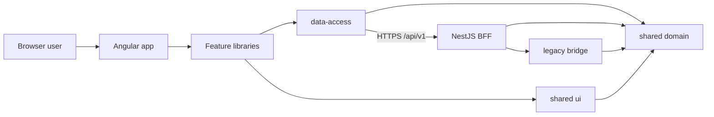
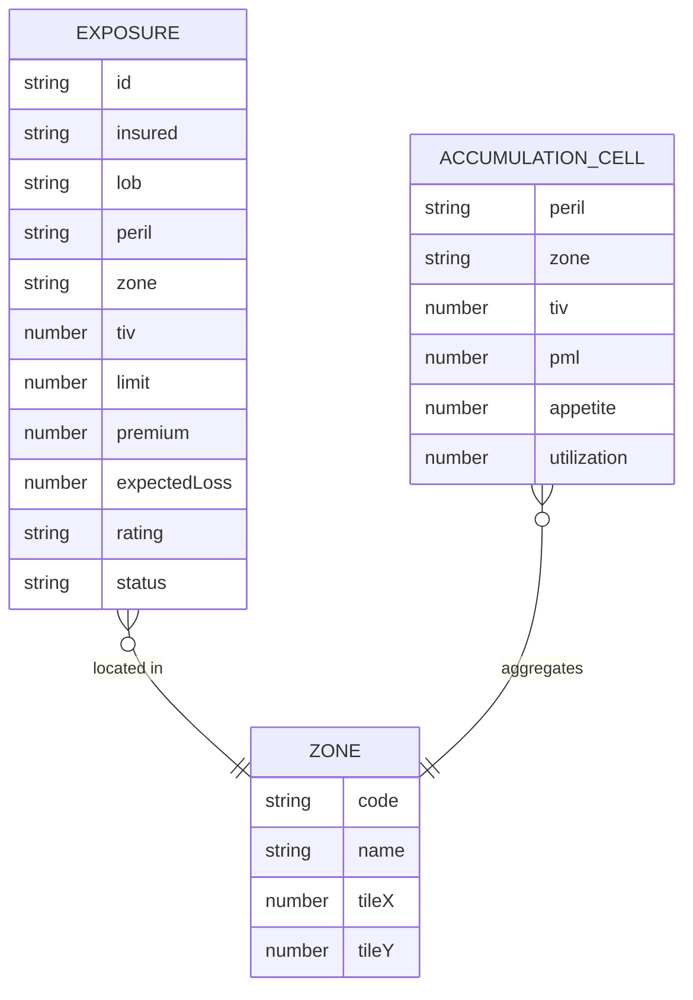
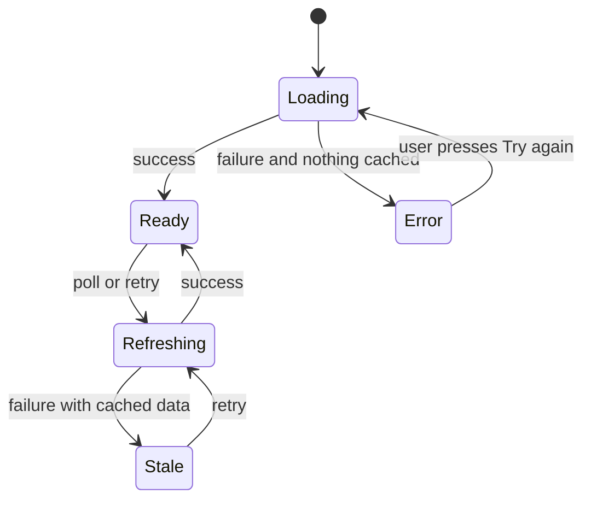
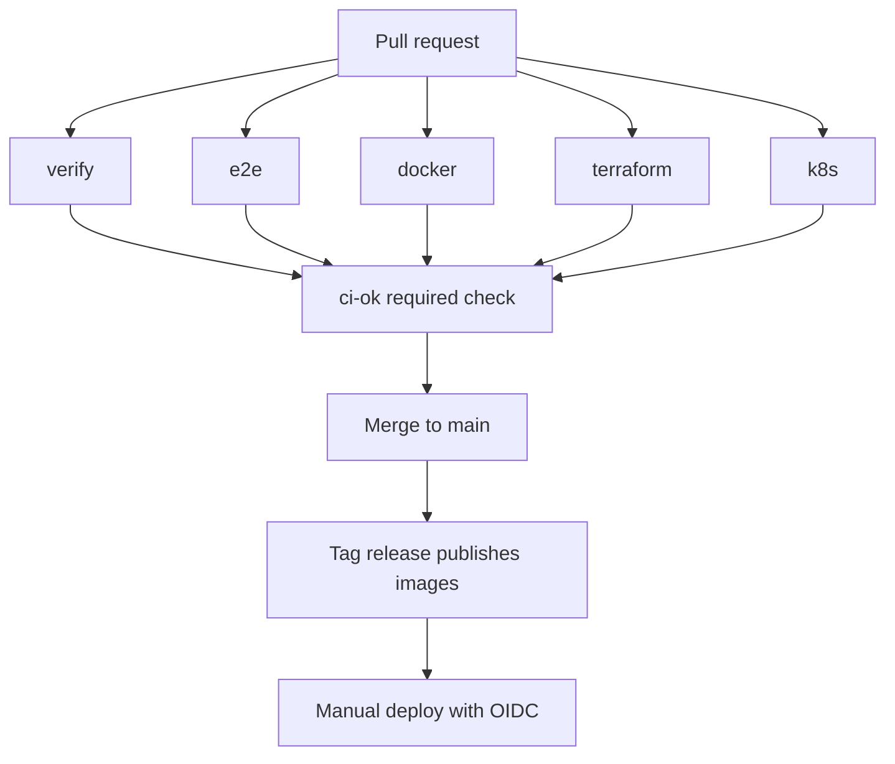

# PNC Risk Console: Solution Deep Dive

*A property and casualty exposure console explained from first principles, with every screen drawn. Written for someone who has never worked in insurance risk.*

> **Reading guide.** §1 to §6 explain the problem and the design. §7 walks the failure modes. §8 is the **screen atlas**: a wireframe for every screen with purpose, role and states. §9 onward covers structure, quality, shipping, limits and a glossary.
> **Honesty note.** Wireframes are drawn from the code as built and were not rendered in a real browser while writing. The risk model is illustrative and the data is synthetic. `SRS-Compliance.md` lists what was and was not verified.

## Contents
1. [The problem in plain words](#1-the-problem-in-plain-words) · 2. [The design in one page](#2-the-design-in-one-page) · 3. [The contracts](#3-the-contracts) · 4. [Guarantees and how each is enforced](#4-guarantees-and-how-each-is-enforced) · 5. [Data model](#5-data-model) · 6. [Who can do what](#6-who-can-do-what) · 7. [What goes wrong, and what happens](#7-what-goes-wrong-and-what-happens) · 8. [Screen atlas](#8-screen-atlas) · 9. [Folder tour](#9-folder-tour) · 10. [Design system](#10-design-system) · 11. [Quality](#11-quality) · 12. [Shipping](#12-shipping) · 13. [Running it](#13-running-it) · 14. [Limits and next steps](#14-limits-and-next-steps) · 15. [FAQ and glossary](#15-faq-and-glossary)

---

## 1. The problem in plain words

An insurer writes tens of thousands of policies. If one hurricane hits one coastline, many policies in the same place pay at once. The company must know, **before** that day, how much it could lose and where it is too concentrated. Underwriters want to find and price individual risks. Risk managers want to ask "what if the storm is 30% worse?" And during an incident, nobody can afford a blank screen.

| Word | Meaning here | Everyday picture |
|---|---|---|
| **Exposure** | What an insurer stands to lose on a policy | The size of the bet |
| **TIV** | Total insured value of the property | The price tag of the thing insured |
| **PML** | Probable maximum loss at a return period (1-in-100 years, and so on) | The bad year you plan for |
| **Accumulation** | Many policies concentrated in one peril and zone | Eggs in one basket |
| **Appetite** | The limit the company is willing to hold per cell | The size of the basket |
| **Stress test** | Re-run the numbers with a harsher storm | A fire drill for the balance sheet |
| **Legacy engine** | Older rating code still in production | The trusted old calculator in the drawer |

## 2. The design in one page

```text
 Browser (Angular 22, signals, zoneless)            Server
+----------------------------------------+        +---------------------------+
| Shell: sidenav, theme, degraded banner |        | NestJS 12 BFF  /api/v1    |
| Dashboard | Exposures | Policy | Accum.|  HTTPS | helmet, throttle, RBAC    |
|        feature libraries (lazy)        |<------>| query engine (SSRM)       |
|----------------------------------------| JSON   | risk model, stress        |
| data-access: interceptors, breaker,    |        | seeded 50k-row dataset    |
| stores (RxJS -> signals)               |        | /healthz  /readyz         |
+----------------------------------------+        +---------------------------+
        |  imports only downward (Nx tags)                 |
        v                                                  v
   shared/domain  shared/ui  shared/legacy-bridge  <-- shared/domain (same types, same model)
```



Three ideas carry the design:
1. **The server owns the big data.** The grid asks for 100 rows at a time; filtering, grouping and totals happen in the BFF.
2. **One domain library, two consumers.** The browser's instant stress preview and the server's authoritative answer use the same model, so they can only differ by rounding and data.
3. **Fail soft, say so.** Last known data is shown with a visible degraded marker, never silently.

## 3. The contracts

All routes are under `/api/v1` except health. Errors are RFC 9457 `application/problem+json` with the correlation id.

| Method and path | Permission | Purpose |
|---|---|---|
| `POST /auth/demo-login` | public (demo only) | Exchange a persona for a signed token |
| `GET /auth/me` | any signed-in | Current user and permissions |
| `POST /exposures/query` | `exposure:read` | Ag-Grid server-side row model request: block, sort, filters, grouping, aggregates |
| `GET /exposures/distinct/:field` | `exposure:read` | Values for set filters |
| `GET /exposures/export.csv` | `exposure:export` | Streamed CSV, spreadsheet-formula safe |
| `GET /exposures/:id` | `exposure:read` | Policy detail with legacy versus modern reconciliation |
| `GET /portfolio/summary` | `portfolio:read` | KPIs, trend, breakdowns, PML ladder |
| `GET /portfolio/accumulation` | `portfolio:read` | Peril by zone cells with appetite |
| `POST /portfolio/stress` | `stress:run` | Authoritative stress result |
| `GET /status` | `admin:status` | Version, uptime, dataset, breaker info |
| `GET /healthz`, `GET /readyz` | public | Liveness and readiness |

A grid request, abridged:
```json
{
  "startRow": 0, "endRow": 100,
  "sortModel": [{ "colId": "tiv", "sort": "desc" }],
  "filterModel": { "lob": { "filterType": "set", "values": ["Cyber"] } },
  "rowGroupCols": [], "groupKeys": [], "valueCols": []
}
```

## 4. Guarantees and how each is enforced

| Guarantee | Enforced by | Proven by |
|---|---|---|
| Browser never holds the full dataset | Server-side row model, 100-row blocks, 1,000-row cap | BFF query-engine tests, integration cap test |
| Users see only what their role allows | Global deny-by-default guard; `@RequirePermissions`; route guards in the app | Integration RBAC tests; E2E auth specs |
| Masked fields cannot be inferred | Filter or sort on a masked column returns 403 | Query-engine and integration tests |
| Exports cannot run spreadsheet formulas | Cell escaping on leading `= + - @` | Integration test |
| Unsafe production config cannot start | zod-validated env refuses default secret, demo auth, chaos | Config unit tests |
| Outages do not blank the UI | Circuit breaker, retry on idempotent calls, stale-while-error | Data-access tests; E2E degraded spec |
| Legacy and modern ratings agree or are flagged | Anti-corruption layer and parity test | Legacy-bridge tests |
| Layering cannot rot | Nx module-boundary lint rule | `npm run lint` in CI |

### The two follow-up questions
**"Why not do the grouping in the browser?"** At 50,000 rows it would work; at 1,000,000 it would freeze the tab and ship data the user may not be allowed to see. **"Why a second copy of the stress math in the browser?"** Sliders must feel instant. The server run is the number you quote; the preview is labelled as an estimate.

## 5. Data model



Seven lines of business, seven perils, 28 zones on a tile map. Rows are generated from a seeded PRNG, so a given seed always yields the same portfolio (tests rely on this).

## 6. Who can do what

| Permission | Viewer | Underwriter | Risk manager | Admin |
|---|:-:|:-:|:-:|:-:|
| `exposure:read` | ✅ | ✅ | ✅ | ✅ |
| `portfolio:read` | ✅ | ✅ | ✅ | ✅ |
| `exposure:read-pii` (unmasked insured) | | ✅ | ✅ | ✅ |
| `exposure:export` | | ✅ | ✅ | ✅ |
| `stress:run` | | | ✅ | ✅ |
| `admin:status` | | | | ✅ |

The matrix lives once, in `libs/shared/domain/src/lib/permissions.ts`; the BFF enforces it and the app's guards and menus mirror it.

## 7. What goes wrong, and what happens



| Failure | System behaviour | User sees |
|---|---|---|
| BFF returns 503 once | Retry with backoff (idempotent calls only) | Nothing; maybe a slightly slower load |
| BFF down for a minute | Breaker opens, stops hammering, half-opens later | Last known numbers with a *degraded* banner |
| Nothing ever loaded | No cache to fall back to | Section-level error with **Try again** and the correlation id |
| Token expired | 401 clears the session | Sign-in page, return URL kept |
| Role lacks permission | 403 problem document | Forbidden page |
| Legacy engine throws a string | Adapter converts to a typed error | Policy page shows "legacy unavailable" and still shows the modern rating |
| Tab hidden | Polling pauses (`visiblePoll`) | Nothing; no wasted calls |

## 8. Screen atlas

Conventions: frames are 1440×900, fluid down to 360. `[ ]` is a button or field, `(x)` an icon, `{x}` a value from data. Every screen sits inside the shell (S01).

### S01 · App shell
```text
+--------------------------------------------------------------------------+
| [Skip to main content]  (hidden until focused)                           |
| (menu) PNC Risk Console                      Uma Underwriter  (sun) [Out]|
|---------------+----------------------------------------------------------|
| Dashboard     | (!) Showing last known data. Retrying...    <- if stale  |
| Exposures     |----------------------------------------------------------|
| Accumulation  |                       <main id="main">                   |
| Status (admin)|                                                          |
+---------------+----------------------------------------------------------+
```
**Purpose** one frame for navigation, identity, theme and degradation. **You can** navigate (entries you cannot use are hidden), toggle light or dark, sign out. **States** default · stale banner · mobile (drawer). **Who** signed-in users.

### S02 · Sign in
```text
+------------------------------------------------+
|              PNC Risk Console                  |
|   Choose a demo persona                        |
|   ( ) Vera Viewer          viewer              |
|   ( ) Uma Underwriter      underwriter         |
|   ( ) Rami Risk-Manager    risk-manager        |
|   ( ) Ada Admin            admin               |
|                      [ Sign in ]               |
+------------------------------------------------+
```
**Purpose** demo identity (replaced by your identity provider in production, `AUTH_MODE=jwt`). **States** idle · signing in · error.

### S03 · Dashboard
```text
+--------------------------------------------------------------------------+
| Portfolio overview                                              [Refresh]|
| +--------+ +--------+ +--------+ +--------+ +--------+ +--------+         |
| | TIV    | | Premium| | Exp.   | | Loss   | | PML100 | | Breach |         |
| | $5B    | | {x}    | | loss   | | ratio  | | {x}    | | cells  |         |
| +--------+ +--------+ +--------+ +--------+ +--------+ +--------+         |
| Trend (line)                  | By line of business (bars)               |
|   /\__/\_/\                   |  Cyber      ████████                     |
|                               |  Marine     █████                        |
| PML ladder: 1-in-10 .. 1-in-500 | By peril (donut)                       |
+--------------------------------------------------------------------------+
```
**Purpose** the one-glance state of the book. **States** loading (progress bar) · ready · stale (status line, data kept) · error with retry. **Who** `portfolio:read`.

### S04 · Exposures grid
```text
+--------------------------------------------------------------------------+
| Exposures   [Reset layout] [Export CSV]*                 *needs export   |
| Row groups: [ Line of business x ]                                       |
|---------------------------------------------------------+----------------|
| Policy  | Insured      | LOB      | Peril | TIV  | Rating| Filters | Cols |
|---------+--------------+----------+-------+------+-------+                |
| > Cyber (1,204)                      sum TIV {x}   avg LR {x}            |
| P-000123| Insured ••4821| Cyber   | Cyber | {x}  |  B    |                |
+--------------------------------------------------------------------------+
```
**Purpose** find, group and total exposures at scale. **You can** group, aggregate, filter (text, number, set, date), sort, export, open a policy, and keep your column layout. **States** loading block · empty · error row · viewer (masked insured, no export button). **Who** `exposure:read`.

### S05 · Policy detail
```text
+--------------------------------------------------------------------------+
| < Back   Policy P-000123                         Rating B   Status Bound |
| Insured {name or masked}   LOB / Peril / Zone    TIV / Limit / Premium   |
|--------------------------------------------------------------------------|
| Rating reconciliation                                                    |
|   Modern engine  score {x}  rating B                                     |
|   Legacy engine  score {x}  rating B        [ Match ] or [ Differs by x ]|
+--------------------------------------------------------------------------+
```
**Purpose** show the old and new engines side by side during migration. **States** loading · match · differs (highlighted) · legacy unavailable · not found.

### S06 · Accumulation
```text
+--------------------------------------------------------------------------+
| Peril [Windstorm v]    Severity [====o-----] +30%   Frequency [==o------]|
|                                         [ Run authoritative stress ]*    |
|  Tile map (28 zones)                          Legend: ok / watch / breach|
|   [WA][MT][ND]                                Preview (estimate)         |
|   [OR][ID][SD][MN]                            Authoritative (server)     |
|   ...                                         Delta PML {x}              |
+--------------------------------------------------------------------------+
```
**Purpose** see concentration and test a harsher scenario. **Rule** the preview is labelled an estimate; only the server run is authoritative. **Who** `portfolio:read`; the run button needs `stress:run` (hidden otherwise).

### S07 · Admin status
```text
+----------------------------------------------+
| Service status                               |
| BFF         (ok)  v1.0.0   uptime {x}        |
| Dataset     50,000 rows  seed {x}            |
| Breaker     closed                           |
+----------------------------------------------+
```
**Who** `admin:status`.

### S08 · System states (wherever they occur)
Forbidden (403), not found, section error with correlation id, loading bars, degraded banner. All use the shared `StatePanel` and meet focus and contrast requirements.

## 9. Folder tour

```text
apps/
  bff/                  NestJS: auth, exposure, portfolio, health, config, common
  risk-console/         Angular shell: routes, guards, login, shell, theme, status
  risk-console-e2e/     Playwright + axe specs
libs/
  shared/domain/        types, risk model, permissions, formatting, PRNG
  shared/legacy-bridge/ ES5 engine + typed adapter
  shared/ui/            KPI card, charts, status chip, state panel, icon
  risk/data-access/     interceptors, circuit breaker, stores, API client
  risk/feature-*/       dashboard, exposure, accumulation, policy
infra/  docker/  terraform/{modules,envs}      k8s/{base,overlays}
.github/ workflows, rulesets, CODEOWNERS, templates     docs/adr
```

## 10. Design system

Angular Material 3 theme with light and dark tokens, charts drawn as inline SVG (no chart library, small bundle), status never conveyed by colour alone (icon plus text), a visible skip link, focus rings, and `prefers-reduced-motion` respected. Charts have text alternatives and the grid is keyboard navigable.

## 11. Quality

| Layer | Count | Result in the authoring sandbox |
|---|--:|---|
| Domain, legacy bridge, UI kit | 15 + 5 + 5 | passing |
| Data access | 17 | passing |
| Feature and app components | 17 | passing |
| BFF unit and integration | 23 + 17 | passing |
| Playwright + axe | 13 tests | **written, not run here** (no browser download) |

Also green: ESLint with Nx boundaries on 11 projects, typecheck on 11 projects, production Angular build within budgets, BFF bundle smoke test.

## 12. Shipping



One required status check keeps branch protection stable as jobs change. Deploys are manual, keyless (OIDC) and gated by environment reviewers. Images run non-root with a read-only root filesystem and no capabilities; Kubernetes adds default-deny network policy, PDBs, HPA and the `restricted` Pod Security level.

## 13. Running it

See [WALKTHROUGH.md](WALKTHROUGH.md): `npm ci`, `npm run dev`, open <http://localhost:4200>, pick a persona.

## 14. Limits and next steps

- Synthetic data and an illustrative risk model; not for regulatory or pricing use.
- Demo authentication; production needs an OIDC identity provider behind `AUTH_MODE=jwt`.
- In-memory dataset; production would read from a warehouse with the same query-engine contract.
- Ag-Grid Enterprise licence is yours to supply.
- Not executed here: Playwright, Docker builds, Terraform validate, kubectl rendering, GitHub Actions.
- Next: audit log of exports, scenario library, multi-tenant filters, micro-frontend split if teams multiply.

## 15. FAQ and glossary

**Why a BFF?** One stable, role-aware API for the UI, and a place to mask data before it leaves the server.
**Why signals and RxJS?** Signals for state the template reads; RxJS for time (poll, retry, cancel). See ADR 0002.
**Why not Nx's Nest plugin?** Its peers cap below Nest 12 (ADR 0001).
**What is an anti-corruption layer?** An adapter that stops a legacy model's quirks leaking into new code (ADR 0005).

| Term | Meaning |
|---|---|
| SSRM | Ag-Grid server-side row model: the server supplies rows on demand |
| BFF | Backend for frontend |
| RBAC | Role-based access control |
| RFC 9457 | Standard JSON error format (Problem Details) |
| OIDC | Keyless, short-lived cloud authentication from GitHub Actions |
| PDB / HPA | Kubernetes disruption budget / horizontal autoscaler |
